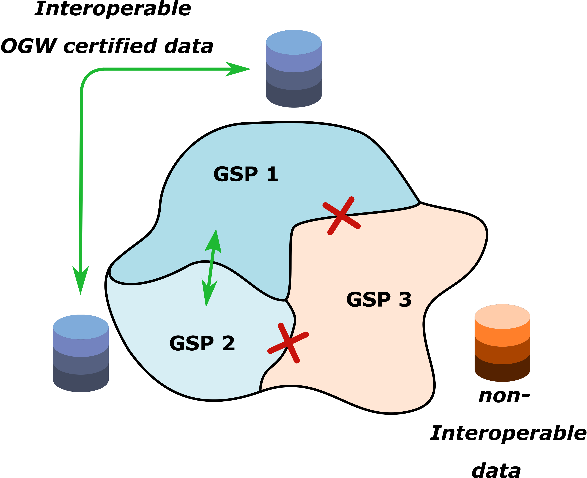

# What is data interoperability?

Groundwater doesn't care where one GSP plan boundary ends and another begins. Two adjacent basins with [OGW certification](certification.html) can seamlessly integrate their groundwater data without ever re-inventing a pre- or post-processing script or workflow.

<br>
<br>

<br>
<br>

# OGW data interoperability in the wild


*highlight two basins that share data and are both OGW certified*

```{r setup, include=FALSE}
knitr::opts_chunk$set(echo = FALSE)

# Learn more about creating websites with Distill at:
# https://rstudio.github.io/distill/website.html

```
