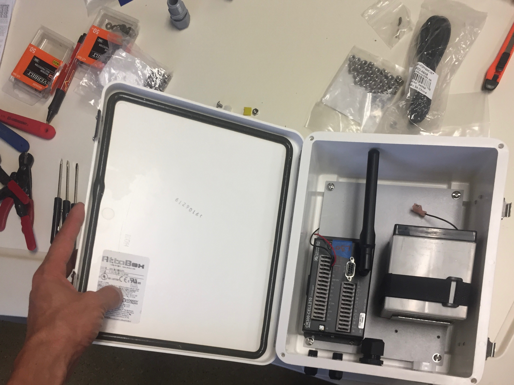
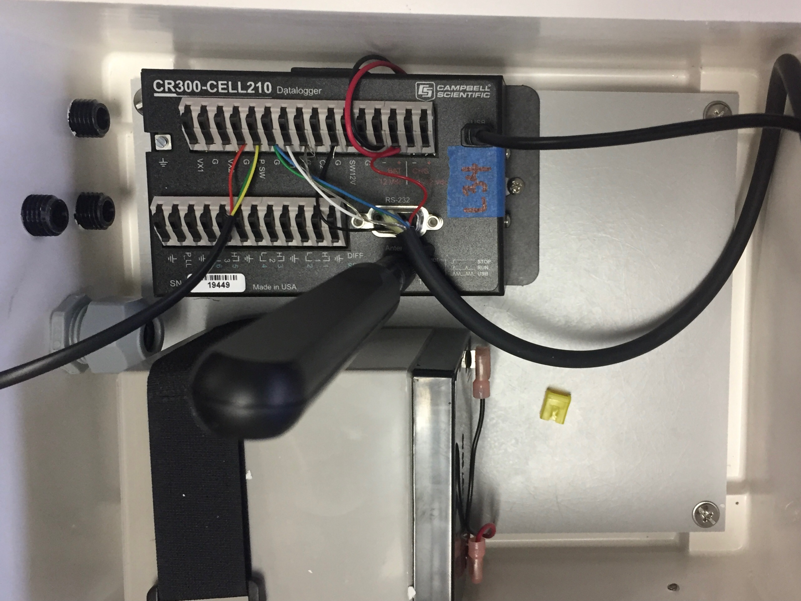

# Motivation

An OGW certified sensor network spanning California's groundwater basins would significantly elevate the state of the art in groundwater in-situ monitoring to other real-time continuous monitoring water resources APIs like [CIMIS](https://cimis.water.ca.gov/) (evapotranspiration) and [CDEC](https://cdec.water.ca.gov/) (streamflow and reservoir level). 

A sensor network spanning many aquifers provide invaluable information to:  

<i class="fas fa-check" style = "color:#50C878"></i> local water managers implementing groundwater sustainability plans  
<i class="fas fa-check" style = "color:#50C878"></i> state agencies monitoring regional groundwater storage  
<i class="fas fa-check" style = "color:#50C878"></i> groundwater markets  
<i class="fas fa-check" style = "color:#50C878"></i> conjunctive use of reservoirs and groundwater basins  
<i class="fas fa-check" style = "color:#50C878"></i> researchers and consultants building hydrologic models  
<i class="fas fa-check" style = "color:#50C878"></i> domestic well owners watching nearby groundwater levels  

# What is an IoT sensor network?

Internet of Things (IoT) sensor technology is ubiquitous, and connects "things" to the internet, for example, cars, homes, water meters, porch cameras, and thermostats. Groundwater IoT sensors powered by solar energy are deployed year-round in monitoring wells, and use cellphone towers to send data from wells to a database, which are then available for analysis, visualization, and critical decision-making. Groundwater elevation sampling is possible at unprecedented temporal scales (minutes), all without ever needing to leave the office.

[OGW certified](certification.html) IoT sensors collect and store data in the [OGW data schema](data-schema.html). 

*conceptual model*  

## Telemetry

Telemetry units consist of...  

  

## Sensors

Groundwater sensors are submerged in a monitoring well and measure the pressure above them. Pressure is converted to a water column height and relayed to the telemetry unit.

*need pictures of sensors here*

## Databases and dashboards

OGW certified databases are by definition, clean and standardized, making them easily to integrate into interactive data dashboards for real-time groundwater level monitoring. 

*dashboard gif scrolling through water levels*

## Automated reporting

An express lane for streamlined data reporting from OGW certified databases directly to XXX databases is not yet offered, but this is an ongoing conversation and we're working hard to make it a reality.  

Streamlined, automated groundwater data reporting would be absolutely transformative, and usher in a new era of groundwater monitoring and management. We would be able to watch groundwater level change in real time, at a hourly to weekly resolution. We could account for water to operate reservoirs and groundwater basins conjunctively and enable groundwater markets.
